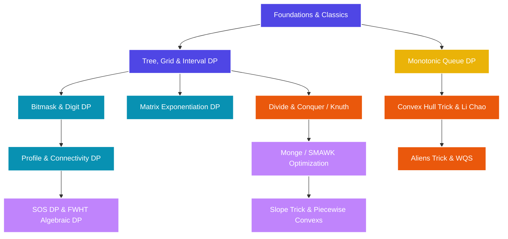

import { TopicCard, TopicGrid } from '../../components/TopicCard'

# Dynamic Programming

Dynamic Programming (DP) is one of the most intellectually rewarding, mathematically elegant, and widely tested subjects in competitive programming. From simple 1D state transitions in Div. 3 contests to advanced geometric optimizations, algebraic structures, and Monge matrix speedups in ICPC World Finals, this guide covers everything with zero compromises.

---

## The Core Philosophy

At its heart, Dynamic Programming is **recursion with memory**. It is applicable to problems exhibiting:
1. **Overlapping Subproblems**: The recursive search space contains the same subproblems repeatedly.
2. **Optimal Substructure**: The optimal solution to the problem can be constructed efficiently from the optimal solutions of its subproblems.

Every DP solution boils down to four non-negotiable steps:
* **State Definition**: Defining exactly what the DP state array (e.g., $dp[i][j]$) represents.
* **Transition Equation**: Expressing the solution of a state as a recurrence relation of smaller states.
* **Base Cases**: Initializing the boundary conditions where the recursion terminates.
* **Optimization (Optional but Common)**: Reducing space complexity (dimension reduction) or time complexity (from $O(N^2)$ to $O(N \log N)$ or $O(N)$ using structural properties).

---

## DP Curriculum Overview

<TopicGrid>
  <TopicCard
    title="1. Foundations & Classic Models"
    href="/dp/foundations"
    description="Memoization vs tabulation, state design, state reduction, and standard templates: LIS, LCS, Knapsack, MCM, Coin Change."
    difficulty="beginner"
    tags={["memoization", "tabulation", "knapsack", "LCS", "LIS"]}
  />
  <TopicCard
    title="2. Tree, Grid & Interval DP"
    href="/dp/classical-dimensions"
    description="Multidimensional grids, DP on intervals, Tree DP, Tree Rerooting, and tree knapsacks."
    difficulty="medium"
    tags={["tree DP", "rerooting", "interval DP", "grids"]}
  />
  <TopicCard
    title="3. Bitmask, Digit & Profile DP"
    href="/dp/state-space"
    description="Bitmask state compression, digit-by-digit constraints, profile & broken-profile tiling, and connectivity/plug DP."
    difficulty="hard"
    tags={["bitmask", "digit DP", "broken profile", "connectivity"]}
  />
  <TopicCard
    title="4. Algebraic & SOS Optimizations"
    href="/dp/algebraic-structural"
    description="Matrix exponentiation for linear transitions, min-plus tropical semirings for shortest paths, and SOS DP + FWHT transitions."
    difficulty="hard"
    tags={["matrix exp", "semirings", "SOS DP", "FWHT"]}
  />
  <TopicCard
    title="5. Convex Hull Trick & Aliens"
    href="/dp/geometric"
    description="Convex Hull Trick (Monotone & Dynamic), Li Chao Tree, and Aliens Trick (WQS binary search / Lagrange multiplier DP)."
    difficulty="expert"
    tags={["CHT", "Li Chao", "Aliens trick", "WQS"]}
  />
  <TopicCard
    title="6. Advanced Speedups & Monotonicity"
    href="/dp/speedups"
    description="Divide & Conquer DP, Knuth's optimization, Slope Trick, Monotonic queue sliding window, and Monge matrix SMAWK algorithm."
    difficulty="expert"
    tags={["divide & conquer", "Knuth", "slope trick", "SMAWK", "Monge"]}
  />
  <TopicCard
    title="7. Dynamic DP & Tree Convolutions"
    href="/dp/dynamic-dp"
    description="Tropical semiring matrix products over HLD paths, DSU on Tree (Sack) for O(N log N) subtree aggregation, and base-3 bracket connectivity Plug DP."
    difficulty="legendary"
    tags={["Dynamic DP", "DDP", "DSU on Tree", "Sack", "Plug DP"]}
  />
</TopicGrid>

---

## DP Dependency Graph

---

## Progressive Learning Roadmap

| Level | Focus Topics | Typical Rating Range | Estimated Prep Time |
| :--- | :--- | :--- | :--- |
| **Level 1: Novice** | Foundations, LCS, LIS, 0/1 Knapsack, Grid DP, Basic State Reductions | 800 - 1400 | 2 - 3 Weeks |
| **Level 2: Apprentice** | Interval DP, Classic Tree DP, Bitmask DP basics, Digit DP basics | 1400 - 1800 | 4 - 6 Weeks |
| **Level 3: Expert** | Tree Rerooting, SOS DP, Matrix Exponentiation, Monotonic Queue Optimization | 1800 - 2200 | 6 - 8 Weeks |
| **Level 4: Master** | Convex Hull Trick, Li Chao Tree, Divide & Conquer DP, Knuth Optimization, Broken Profile DP | 2200 - 2600 | 8 - 10 Weeks |
| **Level 5: Grandmaster** | Aliens Trick, Slope Trick, Min-Plus Semirings, Connectivity/Plug DP, SMAWK Algorithm, Dynamic DP (DDP) | 2600+ | Ongoing |

---

## Core Reading Materials & References

To supplement your reading and study, we recommend keeping these high-quality resources open:
1. **cp-algorithms**: Core explanations of Knuth, Divide & Conquer, and CHT.
2. **OI Wiki (Dynamic Programming)**: The single most comprehensive resource on Earth for advanced techniques like Plug DP, SMAWK, and Slope Trick (available in Chinese, use browser translation).
3. **Codeforces Blogs**:
   - *Aliens Trick / WQS Binary Search* by `tomek` and `Benq`
   - *Slope Trick Explained* by `zscoder`
   - *Broken Profile DP* by `tourist`
4. **USACO Guide (Plat/Advanced)**: Incredible problem analysis, interactive templates, and practice paths.
5. **Introduction to Algorithms (CLRS)**: Chapter on Dynamic Programming for theoretical foundations (e.g. proof of optimal substructure).
