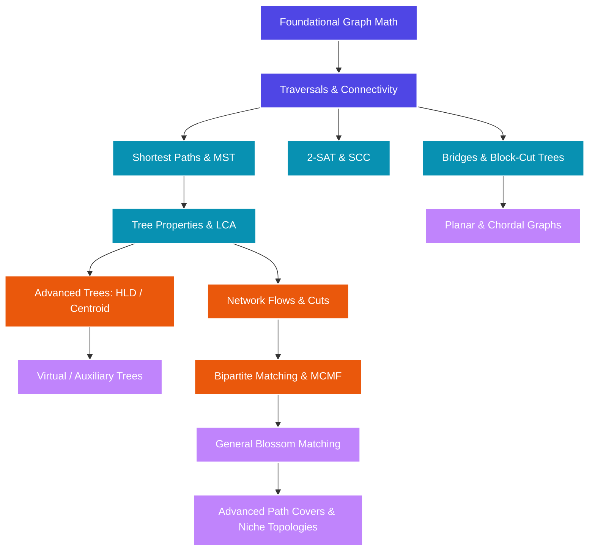

import { TopicCard, TopicGrid } from '../../components/TopicCard'

# Graphs & Trees

Graphs and Trees form the structural backbone of both pure mathematics and competitive programming. Whether you are proving planarity boundaries using Euler's formula, implementing dynamic lowest common ancestors, tracing strongly connected components for 2-SAT, or running maximum bipartite flow matchings, this guide covers every detail with complete mathematical rigor and production-grade C++ templates.

---

## The Core Structural Dimensions

Our curriculum is divided into six progressive segments, starting with the deep mathematical foundations and building up to elite network flows and niche topologies:

<TopicGrid>
  <TopicCard
    title="1. Foundational Graph Theory & Math"
    href="/graphs/math"
    description="Handshaking lemma, planar graphs, Cayley's formula, Tutte matrix, Kirchhoff's Matrix-Tree Theorem, and electrical networks."
    difficulty="medium"
    tags={["planar", "Cayley", "Matrix-Tree", "Laplacian", "resistance"]}
  />
  <TopicCard
    title="2. Traversals & Connectivity"
    href="/graphs/connectivity"
    description="DFS/BFS, topological sorts, Strongly Connected Components (Tarjan/Kosaraju), 2-SAT implication, and block-cut trees."
    difficulty="easy"
    tags={["DFS", "BFS", "SCC", "2-SAT", "block-cut", "bridges"]}
  />
  <TopicCard
    title="3. Shortest Paths & Spanning Trees"
    href="/graphs/shortest-paths-mst"
    description="Dijkstra, SPFA, Dial's, Floyd-Warshall, Kruskal, Prim, Boruvka MST, and Edmonds' Directed MST."
    difficulty="easy"
    tags={["Dijkstra", "SPFA", "Kruskal", "MST", "directed MST"]}
  />
  <TopicCard
    title="4. Tree Properties & Queries"
    href="/graphs/trees"
    description="Diameters, tree hashing, Euler Tour RMQ, Binary Lifting, HLD, Centroid Decomposition, and Virtual Trees."
    difficulty="medium"
    tags={["LCA", "HLD", "centroid", "virtual tree", "isomorphism"]}
  />
  <TopicCard
    title="5. Flows, Cuts & Matchings"
    href="/graphs/flows-matchings"
    description="Ford-Fulkerson, Dinic's, MCMF Dijkstra Potentials, Hopcroft-Karp Bipartite matching, Blossom general matching, and chain covers."
    difficulty="hard"
    tags={["Dinic's", "MCMF", "matching", "blossom", "Dilworth"]}
  />
  <TopicCard
    title="6. Advanced & Niche Graph Concepts"
    href="/graphs/niche-concepts"
    description="Chordal graphs, planarity testing, vertex/path covers, Hierholzer's Eulerian paths, Chinese Postman, and Hamiltonian cycles."
    difficulty="expert"
    tags={["chordal", "planarity", "Eulerian", "Hamiltonian", "TSP"]}
  />
</TopicGrid>

---

## Graph & Tree Dependency Graph

---

## Graphs & Trees Progressive Roadmap

| Level | Focus Topics | Typical Rating Range | Estimated Prep Time |
| :--- | :--- | :--- | :--- |
| **Level 1: Novice** | Graph representations, BFS, DFS, Flood Fill, Basic Trees | 800 - 1200 | 2 Weeks |
| **Level 2: Apprentice** | Dijkstra, Kruskal's MST, Topological Sort, LCA (Binary Lifting) | 1200 - 1600 | 3 - 4 Weeks |
| **Level 3: Expert** | Tarjan's/Kosaraju's SCC, 2-SAT, Bridges & Articulation Points, Floyd-Warshall, Bellman-Ford | 1600 - 2000 | 4 - 6 Weeks |
| **Level 4: Master** | Heavy-Light Decomposition (HLD), Centroid Decomposition, Dinic's Max Flow, Hopcroft-Karp Matching | 2000 - 2400 | 6 - 8 Weeks |
| **Level 5: Grandmaster** | Virtual Trees, Min Cost Max Flow (MCMF), Blossom General Matching, Matrix-Tree Theorem, Chordal Graphs | 2400+ | Ongoing |

---

## Core Literature & References

1. **cp-algorithms**: Incredibly detailed sections on SCC, LCA, shortest paths, and max flow.
2. **OI Wiki (Graph Theory)**: The gold standard for advanced structures, Edmonds Blossom algorithm, block-cut tree implementation, and planar graphs.
3. **USACO Guide (Platinum/Advanced)**: Superb visualizations for HLD, Centroid Decomposition, and flow models.
4. **Graph Theory and its Applications** (Jonathan Gross): Standard academic textbook on graph structures and matching theorems.
